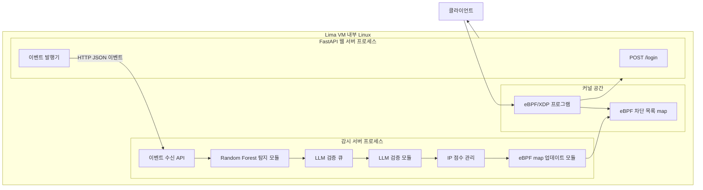
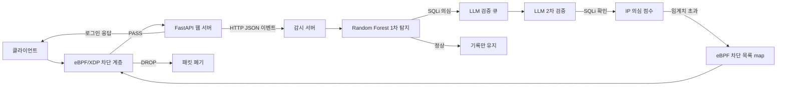

# 아키텍처

## 실행 환경

- 호스트: macOS
- 게스트 런타임: Lima 가상 머신
- 애플리케이션 런타임: Lima VM 내부 Linux
- 패킷 제어 계층: Lima VM 내부 eBPF

## 구성 요소

- FastAPI 웹 서버
- 감시 서버
- eBPF 차단 계층

## 데이터셋

- 학습 데이터셋: HttpParamsDataset
- 데이터셋 URL: https://github.com/Morzeux/HttpParamsDataset
- 사용 목적: SQL Injection 탐지 모델 학습
- 사용 범위: 정상 payload와 SQLi payload

## 컴포넌트 구조

## 처리 흐름

## 웹 서버

- Lima VM 내부에서 실행
- Python FastAPI로 구현
- 포트: `8000`
- 단일 API만 제공
- API: `POST /login`
- 요청 본문: JSON
- 요청 필드: `id`, `password`
- 성공 계정 목록을 메모리에 정의
- 기본 성공 계정: `admin` / `password`
- `id`, `password` 튜플이 성공 계정 목록에 있으면 `201`
- 성공 계정 목록에 없으면 `401`
- 로그인 응답 코드 결정
- 응답 코드 확정 후 이벤트 발행
- 감시 서버로 HTTP JSON 이벤트 전송

## 로그인 이벤트

- 전달 방향: 웹 서버에서 감시 서버
- 전달 방식: HTTP JSON
- 감시 서버 포트: `9000`
- 이벤트 API: `POST /events/login`
- 전송 시점: 로그인 응답 코드 확정 이후
- 전송 방식: 비동기 background task
- 전송 실패 처리: 로그만 남기고 폐기
- 필수 필드: timestamp
- 필수 필드: source IP
- 필수 필드: path
- 필수 필드: method
- 필수 필드: status code
- 필수 필드: `id`
- 필수 필드: `password`
- 로그 출력: 콘솔

## 감시 서버

- 별도 프로세스로 실행
- 포트: `9000`
- 로그인 이벤트 수신
- `status_code == 201` 이벤트 무시
- 탐지 특징 추출
- Random Forest 1차 탐지 실행
- SQLi 의심 이벤트만 LLM 검증 큐에 추가
- LLM 2차 검증 실행
- IP별 의심 점수 관리
- 임계치 초과 source IP 결정
- BCC Python API로 eBPF 차단 목록 map 업데이트

## 탐지 정책

- 1차 탐지: Random Forest
- 2차 검증: Qwen2.5-0.5B
- LLM 학습: 수행 안 함
- LLM 사용 방식: zero-shot
- LLM 실행 방식: 비동기 worker
- LLM 입력: Random Forest가 SQLi 의심으로 분류한 로그인 이벤트
- LLM 출력: `normal` 또는 `sqli`
- LLM 출력 파싱 실패: `normal` 처리
- LLM timeout: 60초
- LLM timeout 발생 시 콘솔 로깅
- 차단 조건: Random Forest와 LLM이 모두 SQLi로 판단
- 차단 기준: 최근 60초 내 source IP별 의심 점수 3회 이상
- Random Forest threshold: SQLi 확률 0.7 이상
- 예외 조건: `status_code == 201`
- `status_code == 201`이면 점수 업데이트 없음
- `status_code == 201`이면 eBPF map 업데이트 없음
- Random Forest 검사 단위: `id`, `password` 각각 검사
- 둘 중 하나라도 SQLi 의심이면 Random Forest positive

## eBPF 계층

- Lima VM 내부 Linux 커널에서 실행
- attach 방식: XDP
- fallback 방식 없음
- attach 인터페이스: `lo`
- XDP 모드: generic XDP
- BCC 기반으로 로드 및 관리
- Python에서 eBPF 프로그램 로드
- Python에서 eBPF map 업데이트
- 패킷 차단 집행 담당
- source IP를 차단 키로 사용
- IPv4만 지원
- 차단된 source IP의 패킷 드롭
- 차단되지 않은 source IP의 패킷 통과
- 차단 목록은 메모리 기반 map으로 유지
- 프로세스 재시작 시 차단 목록 초기화
- HTTP 파싱 수행 안 함
- ML 추론 수행 안 함

## 책임 경계

- FastAPI는 로그인 API 담당
- FastAPI는 응답 코드 포함 이벤트 발행 담당
- 감시 서버는 검사와 탐지 담당
- Random Forest는 빠른 1차 필터 담당
- Qwen2.5-0.5B는 zero-shot 비동기 2차 검증 담당
- eBPF는 커널 수준 패킷 폐기 담당
- BCC는 eBPF 로드와 map 업데이트 담당
- HTTP 페이로드 분석은 사용자 공간에 위치
- 패킷 드롭 집행은 커널 공간에 위치

## 현재 범위

- 단일 보호 API: `POST /login`
- SQL Injection 탐지 대상: `id`, `password`
- 차단 대상: source IP
- 차단 방식: lazy 차단
- 차단 임계치: 최근 60초 내 RF와 LLM 일치 3회
- 차단 해제: 프로세스 재시작
- LLM 실행 위치: Lima VM 내부
- 데모 트래픽: Lima VM 내부 `lo` 인터페이스 plain HTTP
